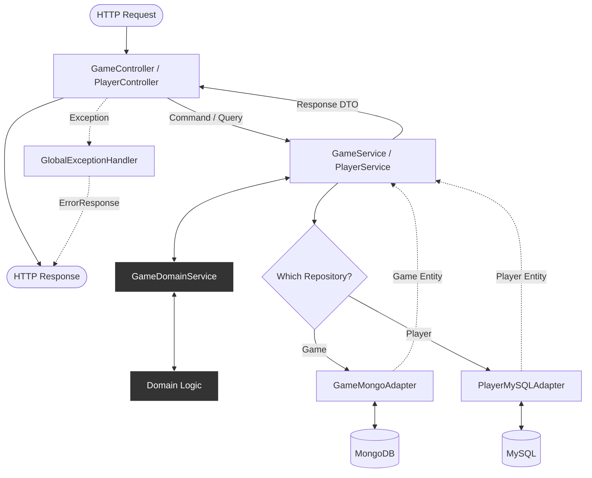
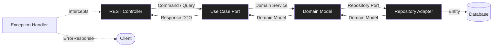

<div align="center">

# ♠️ Blackjack API - Reactive Backend

**Developed by:**
[Federico Cantore](https://github.com/FedEx8525)

*(IT Academy Java Bootcamp - Sprint 5 · Task 1)*

---


</div>

---

## 📖 Description
**Blackjack API** is a fully reactive RESTful backend application built with **Spring WebFlux** that implements the classic Blackjack card game. The application allows players to create games, place bets, execute game actions (HIT/STAND), and track their statistics and rankings.

The project follows **Hexagonal Architecture** (Ports & Adapters), applies **Domain-Driven Design (DDD)** principles with rich domain models, uses a **dual-database strategy** (MongoDB for games, MySQL for players), implements reactive programming with **Project Reactor**, and is fully tested using **TDD** (Test-Driven Development).

---

# 📖 Table of Contents
* [🎮 Game Rules](#-game-rules)
* [🏗️ Project Architecture](#%EF%B8%8F-project-architecture)
* [🔄 Request Flow](#-request-flow-diagram)
* [🛠️ Technologies](#%EF%B8%8F-technologies)
* [📋 Endpoints](#-endpoints)
* [📝 Request & Response Examples](#-request--response-examples)
* [⚙️ Configuration](#%EF%B8%8F-configuration)
* [🚦 Getting Started](#-getting-started)
* [🧪 Testing Strategy](#-testing-strategy)
* [🔧 API Documentation](#-api-documentation)
* [🏆 Business Rules](#-business-rules-implementation)
* [🗄️ Database Schema](#%EF%B8%8F-database-schema)
* [🐳 Docker Configuration](#-docker-configuration)
* [🔒 Exception Handling](#-exception-handling)
* [🚀 Performance & Scalability](#-performance--scalability)
* [📚 Architecture Patterns](#-architecture-patterns)

---

## 🎮 Game Rules
Blackjack (also known as 21) is a comparing card game between a player and a dealer:

* **Goal:** Get a hand value as close to 21 as possible without going over.
* **Card Values:**
    * Number cards (2-10): Face value.
    * Face cards (J, Q, K): 10 points.
    * Aces: 11 points (or 1 if 11 would bust).
* **Blackjack:** Ace + 10-value card in the initial 2 cards = instant win (pays 2.5x).
* **Bust:** Hand value > 21 = automatic loss.
* **Dealer Rules:** Must hit until reaching 17 or higher.
* **Win Conditions:**
    * Player Blackjack (dealer doesn't have Blackjack): Win 2.5x bet.
    * Player closer to 21 than dealer: Win 2x bet.
    * Dealer busts: Win 2x bet.
    * Same score: Tie (bet returned).
    * Dealer closer to 21 or player busts: Lose bet.

---

## 🏗️ Project Architecture
The application is structured following Hexagonal Architecture with clear separation of concerns:

```text
blackjack-api
├── src
│   ├── main
│   │   ├── java/com/blackjack/api
│   │   │   ├── application                    ← Application Layer
│   │   │   │   ├── dto
│   │   │   │   │   ├── command               ← Write operations (CreateGameCommand, etc.)
│   │   │   │   │   ├── query                 ← Read operations (GetGameQuery, etc.)
│   │   │   │   │   └── response              ← DTOs for responses
│   │   │   │   ├── port
│   │   │   │   │   ├── in                    ← Use case interfaces
│   │   │   │   │   └── out                   ← Repository interfaces
│   │   │   │   └── service                   ← Use case implementations
│   │   │   ├── domain                         ← Domain Layer (Core Business Logic)
│   │   │   │   ├── model                     ← Rich domain entities
│   │   │   │   ├── valueobject              ← Type-safe IDs, Money, Score
│   │   │   │   ├── enums                    ← GameStatus, Rank, Suit
│   │   │   │   ├── service                  ← Domain services
│   │   │   │   └── exception                ← Domain exceptions
│   │   │   └── infrastructure                 ← Infrastructure Layer
│   │   │       ├── adapter
│   │   │       │   ├── in/rest               ← REST Controllers
│   │   │       │   └── out/persistence
│   │   │       │       ├── mongo             ← MongoDB adapter (Games)
│   │   │       │       └── mysql             ← MySQL adapter (Players)
│   │   │       ├── config                    ← Spring configuration
│   │   │       └── shared/exception          ← Global exception handler
│   │   └── resources
│   │       ├── application.yml               ← Configuration
│   │       └── schema.sql                    ← MySQL schema initialization
│   └── test                                   ← Comprehensive test suite
├── docker-compose.yml                         ← Multi-container Docker setup
├── Dockerfile                                 ← Application containerization
└── pom.xml
```

---

## 🔄 Request Flow Diagram



---

## 🔄 Hexagonal Architecture Layers


---

## 🛠️ Technologies

| Technology | Version | Purpose |
| :--- | :--- | :--- |
| **Java** | 21 LTS | Main language |
| **Spring Boot** | 3.5.13 | Application framework |
| **Spring WebFlux** | - | Reactive web framework |
| **Project Reactor** | - | Reactive programming |
| **Spring Data MongoDB** | Reactive | MongoDB reactive persistence |
| **Spring Data R2DBC** | - | MySQL reactive persistence |
| **R2DBC MySQL** | - | Reactive MySQL driver |
| **MongoDB** | 7.0 | NoSQL document database (Games) |
| **MySQL** | 8.0 | Relational database (Players) |
| **Spring Validation** | - | Bean Validation (@Valid) |
| **Lombok** | - | Boilerplate reduction |
| **SpringDoc OpenAPI** | 2.3.0 | API documentation (Swagger) |
| **JUnit 5** | - | Test framework |
| **Mockito** | - | Mocking for unit tests |
| **Reactor Test** | - | Reactive testing utilities |
| **Maven** | - | Build & dependency management |
| **Docker** | - | Containerization |
| **Docker Compose** | - | Multi-container orchestration |

---

## 📋 Endpoints
**Base URL:** `http://localhost:8080`

### 🎮 Game Endpoints
| Method | Endpoint | Description | Request Body | Response |
| :--- | :--- | :--- | :--- | :--- |
| **POST** | `/game/new` | Create a new game | `CreateGameRequest` | 201 Created |
| **GET** | `/game/{id}` | Get game details | - | 200 OK / 404 Not Found |
| **POST** | `/game/{id}/bet` | Place a bet | `PlaceBetRequest` | 200 OK / 400 Bad Request |
| **POST** | `/game/{id}/play` | Execute action (HIT/STAND) | `PlayRequest` | 200 OK / 400 Bad Request |
| **DELETE** | `/game/{id}/delete` | Delete game | - | 204 No Content / 404 Not Found |

### 👤 Player Endpoints
| Method | Endpoint | Description | Request Body | Response |
| :--- | :--- | :--- | :--- | :--- |
| **GET** | `/ranking` | Get player rankings | - | 200 OK |
| **PUT** | `/play/{playerId}` | Update player name | `UpdatePlayerNameRequest` | 200 OK / 404 Not Found |

---

## 📝 Request & Response Examples

### Create New Game
**POST** `/game/new`

```json
// Request
{
  "playerName": "Alice"
}

// Response 201
{
  "gameId": "66abc123def456789",
  "playerId": "player-uuid-123",
  "playerHand": [
    {"rank": "ACE", "suit": "SPADES", "display": "A♠"},
    {"rank": "KING", "suit": "HEARTS", "display": "K♥"}
  ],
  "dealerHand": [
    {"rank": "TEN", "suit": "DIAMONDS", "display": "10♦"},
    {"rank": "SEVEN", "suit": "CLUBS", "display": "7♣"}
  ],
  "playerScore": 21,
  "dealerScore": 17,
  "bet": 0.0,
  "status": "PLAYER_BLACKJACK",
  "createdAt": "2026-04-17T10:30:00",
  "remainingCards": 48
}
```

### Place Bet
**POST** `/game/{id}/bet`

```json
// Request
{
  "betAmount": 50.0
}

// Response 200
{
  "gameId": "66abc123def456789",
  "playerId": "player-uuid-123",
  "playerHand": [...],
  "dealerHand": [...],
  "playerScore": 19,
  "dealerScore": 17,
  "bet": 50.0,
  "status": "IN_PROGRESS",
  "createdAt": "2026-04-17T10:30:00",
  "remainingCards": 48
}
```

### Execute Play Action
**POST** `/game/{id}/play`

```json
// Request (HIT)
{
  "action": "HIT"
}

// Request (STAND)
{
  "action": "STAND"
}

// Response 200
{
  "gameId": "66abc123def456789",
  "playerId": "player-uuid-123",
  "playerHand": [
    {"rank": "QUEEN", "suit": "SPADES", "display": "Q♠"},
    {"rank": "NINE", "suit": "HEARTS", "display": "9♥"},
    {"rank": "TWO", "suit": "DIAMONDS", "display": "2♦"}
  ],
  "dealerHand": [
    {"rank": "KING", "suit": "CLUBS", "display": "K♣"},
    {"rank": "EIGHT", "suit": "SPADES", "display": "8♠"}
  ],
  "playerScore": 21,
  "dealerScore": 18,
  "bet": 50.0,
  "status": "PLAYER_WIN",
  "createdAt": "2026-04-17T10:30:00",
  "remainingCards": 45
}
```

### Get Ranking
**GET** `/ranking`

```json
// Response 200
{
  "ranking": [
    {
      "position": 1,
      "playerId": "player-uuid-123",
      "name": "Alice",
      "gamesWon": 45,
      "gamesPlayed": 50,
      "winRate": 0.90
    },
    {
      "position": 2,
      "playerId": "player-uuid-456",
      "name": "Bob",
      "gamesWon": 25,
      "gamesPlayed": 50,
      "winRate": 0.50
    }
  ]
}
```

### Error Response

```json
{
  "timestamp": "2026-04-17T10:30:00",
  "status": 404,
  "error": "Resource not found",
  "message": "Game with ID: 66abc123def456789 not found",
  "path": "/game/66abc123def456789"
}
```

---

## ⚙️ Configuration
The application uses environment variables with profile-specific defaults:

### Development Profile (default)
| Variable | Default Value | Description |
| :--- | :--- | :--- |
| **MONGO_URI** | `mongodb://localhost:27017/blackjack` | MongoDB connection URI |
| **DB_URL** | `r2dbc:mysql://localhost:3306/blackjack` | MySQL R2DBC URL |
| **DB_USER** | `blackjack_user` | MySQL username |
| **DB_PASSWORD** | `blackjack_pass` | MySQL password |
| **SERVER_PORT** | `8080` | Application port |

### Production Profile
| Variable | Default Value | Description |
| :--- | :--- | :--- |
| **MONGO_URI** | `mongodb://blackjack-mongodb:27017/blackjack` | MongoDB container URI |
| **DB_URL** | `r2dbc:mysql://blackjack-mysql:3306/blackjack` | MySQL container URL |
| **DB_USER** | `blackjack_user` | MySQL username |
| **DB_PASSWORD** | `blackjack_pass` | MySQL password |

### Game Configuration
| Property | Default Value | Description |
| :--- | :--- | :--- |
| `blackjack.game.initial-balance` | `1000` | Starting player balance |
| `blackjack.game.min-bet` | `10` | Minimum bet amount |
| `blackjack.game.max-bet` | `500` | Maximum bet amount |

---

## 🚦 Getting Started

### Prerequisites
* **Java 21**
* **Maven 3.x**
* **Docker & Docker Compose**
* **MongoDB 7.0+** (if running locally)
* **MySQL 8.0+** (if running locally)

### 🐳 Run with Docker Compose (Recommended)
1. **Clone the repository:**
```bash
git clone https://github.com/FedEx8525/5.1-BlackJack-API.git
cd 5.1-BlackJack-API
```
2. **Start all services:**
```bash
docker-compose up -d
```
This will start:

- MongoDB container on port 27017
- MySQL container on port 3306
- Blackjack API container on port 8080

3. **Verify containers are running:**
```bash
docker-compose ps
```
4. **Access the API:**

http://localhost:8080

5. **Access Swagger UI:**

http://localhost:8080/swagger-ui.html

6. **Stop all services:**
```bash
docker-compose down
```
7. **Stop and remove volumes (clean slate):**
```bash
docker-compose down -v
```
---

### 🖥️ Run Locally
1. **Clone the repository:**
```bash
git clone https://github.com/FedEx8525/5.1-BlackJack-API.git
cd 5.1-BlackJack-API
```
2. Start MongoDB:
```bash
# Windows (as Administrator)
net start MongoDB

# macOS/Linux
sudo systemctl start mongod
```
3. Start MySQL and create database:
```bash
# Windows (as Administrator)
net start MySQL80

# Connect and create database
mysql -u root -p
CREATE DATABASE blackjack;
CREATE USER 'blackjack_user'@'localhost' IDENTIFIED BY 'blackjack_pass';
GRANT ALL PRIVILEGES ON blackjack.* TO 'blackjack_user'@'localhost';
FLUSH PRIVILEGES;
EXIT;
```
4. Build and run:
```bash
./mvnw clean install
./mvnw spring-boot:run
```
5. Access the API:
```bash
http://localhost:8080
```
6. Access Swagger UI:
```bash
http://localhost:8080/swagger-ui.html
```
---

### 🧪 Testing Strategy
The project follows TDD (Test-Driven Development) with comprehensive test coverage across all layers:

#### Test Structure
| Test Class | Type | Tool | What it tests |
| :--- | :--- | :--- | :--- |
| **Domain Layer** | | | |
| GameTest | Unit | JUnit 5 | Game domain logic, state transitions |
| HandTest | Unit | JUnit 5 | Hand scoring, blackjack detection |
| PlayerTest | Unit | JUnit 5 | Player statistics, balance management |
| ScoreTest | Unit | JUnit 5 | Score calculation, comparison logic |
| **Domain Services** | | | |
| BetValidatorTest | Unit | JUnit 5 | Bet validation rules |
| **Application Layer** | | | |
| GameServiceTest | Unit | Mockito + Reactor Test | Use case orchestration |
| PlayerServiceTest | Unit | Mockito + Reactor Test | Player use cases |
| **Infrastructure Layer** | | | |
| GameControllerTests | Unit | WebFluxTest + MockMvc | REST endpoints |
| PlayerControllerTest| Unit | WebFluxTest + MockMvc | REST endpoints |

#### Run All Tests
```bash
./mvnw test
```
#### Run Special Tests
```bash
./mvnw test -Dtest=GameTest
```
### Test Coverage
The test suite covers:

* ✅ All CRUD operations (Create, Read, Update, Delete)
* ✅ Domain invariants and business rules
* ✅ Game state transitions and winner determination
* ✅ Bet validation and balance management
* ✅ Player statistics and ranking calculation
* ✅ Edge cases (empty decks, blackjack, bust, tie)
* ✅ Error handling (404 Not Found, 400 Bad Request)
* ✅ Reactive flows with StepVerifier

#### Test Data Builders (Mother Pattern)
The project uses the **Object Mother** pattern for test data:
```
// GameMother.java
Game game = GameMother.newGame();
Game gameWithBet = GameMother.gameWithBet(50.0);
Game completedGame = GameMother.gamePlayerWon();

// PlayerMother.java
Player player = PlayerMother.defaultPlayer();
Player richPlayer = PlayerMother.richPlayer();
Player topRanked = PlayerMother.topRankedPlayer();

// HandMother.java
Hand blackjack = HandMother.blackjackHand();
Hand busted = HandMother.bustedHand();

// DeckMother.java
Deck standardDeck = DeckMother.standardDeck();
Deck deckForPlayerBlackjack = DeckMother.deckForPlayerBlackjack();
```
---

### 🔧 API Documentation
The API is fully documented using **OpenAPI 3.0 (Swagger)**.

#### Access Swagger UI:

http://localhost:8080/swagger-ui.html

#### Access OpenAPI JSON:

http://localhost:8080/v3/api-docs

#### Features:
* **Interactive API testing**
* **Request/Response schemas**
* **Example payloads**
* **Organized by tags** (Game, Player)
* **HTTP status codes documentation**

### 🎯 Game Flow Example
Complete game workflow:
```bash
# 1. Create a new game for player "Alice"
POST /game/new
{
  "playerName": "Alice"
}
# → Returns gameId, initial cards, status

# 2. Place a bet of 50€
POST /game/{gameId}/bet
{
  "betAmount": 50.0
}
# → Bet registered, balance deducted

# 3. Player decides to HIT (take another card)
POST /game/{gameId}/play
{
  "action": "HIT"
}
# → New card added to player hand

# 4. Player decides to STAND (end turn)
POST /game/{gameId}/play
{
  "action": "STAND"
}
# → Dealer plays automatically, game resolves, winner determined

# 5. Check updated player statistics
GET /ranking
# → Alice's stats updated with win/loss

# 6. Get game details
GET /game/{gameId}
# → View final state, cards, scores

# 7. Clean up (optional)
DELETE /game/{gameId}/delete
# → Game removed from database
```
---

### 🏆 Business Rules Implementation

#### Domain Invariants
✅ **Game Rules:**

* Game must have a valid player ID and deck
* Bets can only be placed in `IN_PROGRESS` status
* Bets must be between min and max configured amounts
* Players must have sufficient balance to bet
* Dealer must hit until reaching 17+
* Game automatically determines winner on `STAND`

✅ **Player Rules:**

* Player name cannot be empty
* Balance cannot go negative
* Statistics (wins/losses/played) are automatically maintained
* Win rate is calculated as `wins / games played`

✅ **Scoring Rules:**

* Numbered cards = face value
* Face cards (J, Q, K) = 10
* Ace = 11 (or 1 if 11 would bust)
* **Blackjack** = Ace + 10-value card in first 2 cards
* **Bust** = score > 21

✅ **Payouts:**

* **Blackjack:** 2.5x bet (original bet + 1.5x winnings)
* **Normal win:** 2x bet
* **Tie:** Bet returned
* **Loss:** Bet lost

---

### 🗄️ Database Schema

#### MongoDB (Games)
**Collection:** `games`
```javascript
{
  "_id": ObjectId("66abc123def456789"),
  "playerId": "player-uuid-123",
  "createdAt": ISODate("2026-04-17T10:30:00Z"),
  "playerHand": ["A♠", "K♥"],
  "dealerHand": ["10♦", "7♣"],
  "remainingCards": ["Q♠", "9♥", ...],
  "bet": 50.0,
  "status": "PLAYER_BLACKJACK"
}
```

#### MySQL (Players)
**Table**: `players`
```sql
CREATE TABLE players (
  id VARCHAR(255) PRIMARY KEY,
  name VARCHAR(100) NOT NULL UNIQUE,
  balance DECIMAL(10,2) NOT NULL DEFAULT 0,
  games_played INT NOT NULL DEFAULT 0,
  games_won INT NOT NULL DEFAULT 0,
  games_lost INT NOT NULL DEFAULT 0,
  INDEX idx_name (name),
  INDEX idx_win_rate (games_won, games_played)
);
```
---

### 🐳 Docker Configuration
**Multi-Container Setup**
```yml
services:
  # MongoDB for game state
  mongodb:
    image: mongo:7.0
    ports: ["27017:27017"]
    environment:
      MONGO_INITDB_DATABASE: blackjack
    volumes:
      - mongodb_data:/data/db
    healthcheck:
      test: ["CMD", "mongosh", "--eval", "db.adminCommand('ping')"]

  # MySQL for player data
  mysql:
    image: mysql:8.0
    ports: ["3306:3306"]
    environment:
      MYSQL_DATABASE: blackjack
      MYSQL_USER: blackjack_user
      MYSQL_PASSWORD: blackjack_pass
    volumes:
      - mysql_data:/var/lib/mysql
    healthcheck:
      test: ["CMD", "mysqladmin", "ping", "-h", "localhost"]

  # Blackjack API
  api:
    build: .
    ports: ["8080:8080"]
    environment:
      - SPRING_PROFILES_ACTIVE=prod
      - MONGO_URI=mongodb://mongodb:27017/blackjack
      - DB_URL=r2dbc:mysql://mysql:3306/blackjack
    depends_on:
      - mongodb
      - mysql
```
---

### 🔒 Exception Handling
The API implements comprehensive error handling via `GlobalExceptionHandler`:

| Exception | HTTP Status | Description |
| :--- | :--- | :--- |
| `GameNotFoundException` | 404 Not Found | Game ID doesn't exist |
| `PlayerNotFoundException` | 404 Not Found | Player ID doesn't exist |
| `InvalidBetException` | 400 Bad Request | Bet outside min/max range |
| `InsufficientBalanceException` | 400 Bad Request | Player balance too low |
| `ValidateGameException` | 400 Bad Request | Game state violation |
| `DomainException` | 400 Bad Request | Domain rule violation |
| `WebExchangeBindException` | 400 Bad Request | Validation error |
| `Exception` | 500 Internal Server Error | Unexpected error |

#### Error Response Format:
```json
{
  "timestamp": "2026-04-17T10:30:00",
  "status": 404,
  "error": "Resource not found",
  "message": "Game with ID: 66abc123def456789 not found",
  "path": "/game/66abc123def456789",
  "details": null
}
```
---

### 🚀 Performance & Scalability

#### Reactive Stack Benefits
* ✅ **Non-blocking I/O:** All database operations use reactive drivers (R2DBC, MongoDB Reactive)
* ✅ **Efficient Resource Usage:** Thread pool remains small even under high load
* ✅ **Backpressure Support:** Built-in flow control with Project Reactor
* ✅ **Streaming Responses:** Large datasets streamed without buffering

#### Database Strategy
* ✅ **Polyglot Persistence:**
    * **MongoDB:** Fast writes for game state (transient data)
    * **MySQL:** Strong consistency for player data (permanent records)
* ✅ **Connection Pooling:**
    * **R2DBC pool:** 5-10 connections (configurable)
    * **MongoDB:** Auto-managed by driver

---

### 📚 Architecture Patterns

#### Design Patterns Used
| Pattern | Where | Purpose |
| :--- | :--- | :--- |
| **Hexagonal Architecture** | Overall structure | Decoupling business logic from infrastructure |
| **CQRS (lite)** | Application layer | Separate commands (writes) from queries (reads) |
| **Repository Pattern** | Persistence | Abstraction over data access |
| **Aggregate Pattern** | Domain | Consistency boundaries (Game, Player) |
| **Value Object** | Domain | Immutable types (Money, Score, GameId) |
| **Domain Service** | Domain | Cross-aggregate logic (GameDomainService) |
| **Adapter Pattern** | Infrastructure | MongoDB/MySQL adapters |
| **Builder Pattern** | Domain entities | Flexible object construction (Lombok @Builder) |
| **Object Mother** | Tests | Test data creation |

#### DDD Tactical Patterns
* ✅ **Entities:** Game, Player, Hand, Deck
* ✅ **Value Objects:** Money, Score, GameId, PlayerId, Card
* ✅ **Aggregates:** Game (root), Player (root)
* ✅ **Domain Services:** GameDomainService, BetValidator
* ✅ **Repositories:** GameRepository, PlayerRepository

---

### 🎓 Learning Outcomes
This project demonstrates:
* ✅ Reactive Programming with **Spring WebFlux** and **Project Reactor**
* ✅ **Hexagonal Architecture** with clear separation of concerns
* ✅
